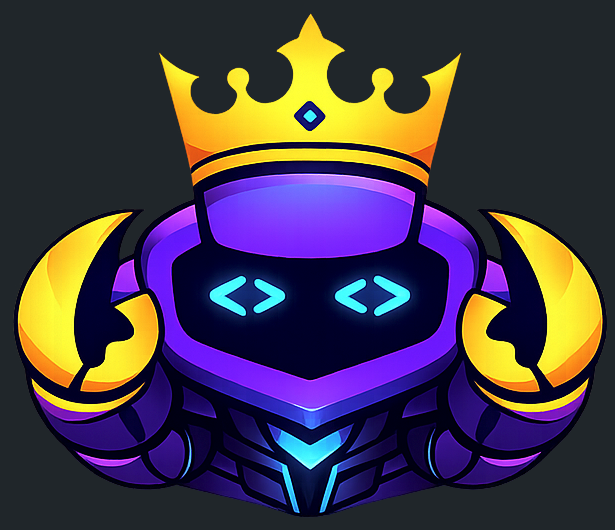
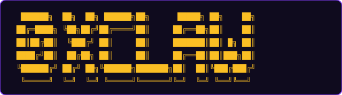

<div align="center">



<br />



<br />

**Give it a hackathon URL. It researches, codes, and submits.**

<br />


</div>

---

## Setup

```bash
conda create -n 0xclaw python=3.11 -y && conda activate 0xclaw
pip install -e .
cp .env.example .env          # fill in FLOCK_API_KEY at minimum
./scripts/verify_setup.sh
```

## Launch

```bash
conda activate 0xclaw
0xclaw           # interactive CLI
0xclaw --logs    # with debug output
```

---

## Pipeline

The agent runs a 7-phase pipeline to produce a complete hackathon submission.
Trigger any phase with natural language — routing is automatic.

<div align="center">
<table>
<tr><th>#</th><th>Phase</th><th>Output</th></tr>
<tr><td>1</td><td><b>research</b></td><td><code>hackathon/context.json</code></td></tr>
<tr><td>2</td><td><b>idea</b></td><td><code>hackathon/ideas.json</code></td></tr>
<tr><td>3</td><td><b>selection</b></td><td><code>hackathon/selected_idea.json</code></td></tr>
<tr><td>4</td><td><b>planning</b></td><td><code>hackathon/plan.md</code> · <code>tasks.json</code></td></tr>
<tr><td>5</td><td><b>coding</b></td><td><code>hackathon/project/</code></td></tr>
<tr><td>6</td><td><b>testing</b></td><td><code>hackathon/test_results.json</code></td></tr>
<tr><td>7</td><td><b>doc</b></td><td><code>hackathon/submission/</code></td></tr>
</table>
</div>

```
research the hackathon requirements
generate project ideas
plan the architecture
implement the project
run tests
write the documentation
```

## Commands

<div align="center">
<table>
<tr><td><code>/status</code></td><td>Pipeline progress + session token usage</td></tr>
<tr><td><code>/resume</code></td><td>Resume from last checkpoint</td></tr>
<tr><td><code>/redo &lt;phase&gt;</code></td><td>Reset phase and all downstream, then re-run</td></tr>
<tr><td><code>/new</code></td><td>Clear all outputs, fresh start</td></tr>
<tr><td><code>/stop</code></td><td>Cancel running task</td></tr>
<tr><td><code>/help</code></td><td>Show all commands</td></tr>
</table>
</div>

Long-running phases hand off to the background after the first reply — you can keep chatting while work continues.

---

## Models

Primary inference via **FLock.io** · Fallback via **Z.AI**

<div align="center">
<table>
<tr><th>Phases</th><th>Model</th><th>Context</th></tr>
<tr><td>research · idea · selection · doc</td><td><code>minimax-m2.1</code></td><td>196k</td></tr>
<tr><td>planning · coding · testing</td><td><code>minimax-m2.5</code></td><td>205k</td></tr>
</table>
</div>

## Observability

Set `ANYWAY_API_KEY` to stream traces to Anyway. Token usage is shown live after every agent response.

---

## Sponsors

<div align="center">
<table>
<tr><td><b>Gold</b></td><td>FLock.io · Z.AI · Sierra.ai · Cantor8 · BGA</td></tr>
<tr><td><b>Silver</b></td><td>Lovable · SuperCell · Animoca Brands · Anyway · The Compression Company</td></tr>
<tr><td><b>Bronze</b></td><td>Virtuals Protocol · Unibase</td></tr>
</table>
</div>

---

<div align="center">
<sub>Built for <a href="https://dorahacks.io/hackathon/1985">UK AI Agent Hackathon EP4</a> in collaboration with OpenClaw · Runtime powered by <a href="https://github.com/HKUDS/nanobot">nanobot</a></sub>
</div>
