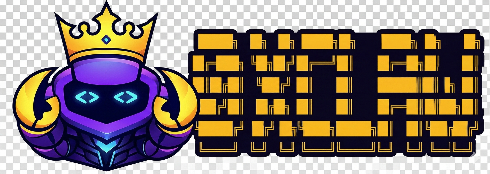
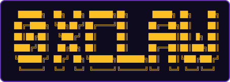

# 0xClaw

**Autonomous hackathon agent** — give it a hackathon URL; it runs research through submission on your machine.

<div align="center">



<br />

<!-- 

<br /> -->

**🏆 1st Place Winner – Z.ai Bounty @ UK AI Agent Hackathon × OpenClaw 🦞.**

**🏆 Finalist Winner – Anyway Bounty @ UK AI Agent Hackathon × OpenClaw 🦞.**

**Give 0xClaw a hackathon URL — it researches, codes, tests, and submits, all on its own.**

<br />

[](https://discord.gg/rdnYEVdRHe)
[](https://python.org)
[](./LICENSE)
[](http://z.ai)
[](https://flock.io)

</div>

---

## 🚀 Quick start

```bash
conda create -n 0xclaw python=3.11 -y
conda activate 0xclaw
pip install -e .
cp .env.example .env
./scripts/verify_setup.sh
```

Fill `.env` from the table below. Optional dev tools: `pip install -e .[dev]` (Ruff). Entry point: **`0xclaw`** (also `python launcher/__main__.py`).

| Variable / tool | Role | Where to get it | When needed |
| --- | --- | --- | --- |
| `ZAI_API_KEY` | Default inference (Z.ai, Claude-compatible coding API) | [Z.ai](https://z.ai/model-api) · [docs](https://docs.z.ai/) | Default `config.json` |
| `FLOCK_API_KEY` | Secondary provider | [FLock](https://platform.flock.io) · [docs](https://docs.flock.io/flock-products/api-platform/getting-started) | When using FLock |
| `FIRECRAWL_API_KEY` | Research scraping via `firecrawl-mcp` | [Firecrawl](https://www.firecrawl.dev) | Heavy / gated sponsor docs |
| `E2B_API_KEY` | Phase 6 sandbox tests | [E2B](https://e2b.dev/docs/api-key) | `subagents.testing.sandbox = "e2b"` |
| `BRAVE_API_KEY` | Optional web search | [Brave Search API](https://brave.com/search/api/) | Brave tool enabled |
| `claude` CLI | Claude Code backend | [Anthropic docs](https://docs.anthropic.com/en/docs/claude-code/getting-started) | Coding/testing `backend = "claude_code"` |

**Suggested order:** `ZAI_API_KEY` first → add `FIRECRAWL_API_KEY` before research on doc-heavy tracks → `E2B_API_KEY` before sandbox testing → FLock / Brave only if you turn those on.

```bash
npm install -g @anthropic-ai/claude-code
claude   # one-time login
```

Firecrawl is spawned from `0xclaw/config/config.json` with `npx -y firecrawl-mcp`, so **Node/npm** must be available when that path is enabled. It can still hit CAPTCHA / Cloudflare; pass stable doc roots with `docs=<url1>,<url2>` on the research command when possible.

**Limits (short):** E2B does not bypass third-party auth or private registries — put anything the build needs into the generated project’s `.env.example` / README. There is **no** checked-in CI or automated test suite yet; use `ruff check 0xclaw launcher scripts` locally if you install dev extras.

`requirements.txt` mirrors runtime deps for non-editable installs.

---

## 🚀 Run

```bash
conda activate 0xclaw
0xclaw                 # interactive CLI
0xclaw --logs          # verbose logging
0xclaw gateway         # messaging channels (see config)
0xclaw whatsapp login  # QR login; state under ~/.0xclaw/
```

- **`./scripts/start.sh`** — optional wrapper (conda + `.env` + `0xclaw`).
- **`./scripts/verify_setup.sh`** — preflight only, not the runtime.
- **`scripts/run_phase.py`** — single-phase debugging.
- **`scripts/hackathon_runner.py`** — legacy path; prefer the main CLI + `/resume`.

Telegram: set `channels.telegram` in `0xclaw/config/config.json`, then `0xclaw gateway` (long polling, no public webhook). WhatsApp: configure `channels.whatsapp`, run `0xclaw whatsapp login`, then gateway.

---


## 👾 Demo Video

<div align="center">
  <a href="https://www.youtube.com/watch?v=jmamrAxRuec">
    
  </a>
</div>

Example prompts:

```text
research <hackathon_url> docs=<sponsor_docs>,<sdk_docs>
generate project ideas
plan the architecture
implement the project
run tests
write the documentation
```

Research uses sitemap expansion in `0xclaw/orchestration/doc_explorer.py` for `docs=` roots; `workspace/skills/hackathon-research/SKILL.md` defines scraping and `sources[]` citation rules.

---

## ⌨️ CLI

Sessions are JSONL under `workspace/sessions/` (`cli:…` keys). Each launch starts a fresh `cli:run-…` until you attach another thread.

| Command | Meaning |
| --- | --- |
| `/status` | Pipeline state, active session, token usage |
| `/resume` · `/resume N` | Pick a conversation, then continue from `pipeline_state.json` |
| `/sessions` · `/sessions N` | List or switch session without running the pipeline |
| `/session …` | Switch, rename, or picker — see `/help` |
| `/redo <phase>` | Reset phase and downstream, then re-run |
| `/new` | Clear hackathon artefacts + new CLI thread + agent `/new` |
| `/stop` | Cancel current work |
| `/help` · `?` | Help |
| `!<cmd>` | Shell passthrough (same privileges as your user) |

At the `/resume` row prompt, `cancel` / `q` or Ctrl+C aborts without changing the active thread. Long phases may continue in the background; Ctrl+C interrupts the current wait, not the whole CLI — use `/exit` to quit.

### `CLAUDE.md`

Optional Cursor / Claude Code notes at repo root. The file is **gitignored** and not shipped with the repo; maintain your own copy locally if you use it.

---

## 🧠 Models

Default pipeline model is **`glm-5.1`** (see `0xclaw/config/model_profiles.json` for per-phase overrides and timeouts). Inference is wired for **Z.ai** and **FLock.io** via `0xclaw/config/config.json`.

Per-phase model, timeout, and token settings are defined in `0xclaw/config/model_profiles.json` (source of truth).

## 💬 Channels

Runtime includes adapters for **Telegram, Discord, Slack, Email, Feishu, DingTalk, Matrix, WeChat Work, QQ, WhatsApp** (coverage varies by platform). Enable each in `0xclaw/config/config.json` plus the matching env / token from provider docs.

---

## Demo

[](https://www.youtube.com/watch?v=jmamrAxRuec)

---

<div align="center">


</div>

<div align="center">
<sub>Built for <a href="https://dorahacks.io/hackathon/1985">UK AI Agent Hackathon EP4</a> in collaboration with 🦞 <a href="https://github.com/openclaw/openclaw">OpenClaw</a>  · Thanks to <a href="https://github.com/HKUDS/nanobot">Nanobot 🐈</a> framework</sub>
</div>
